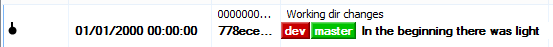
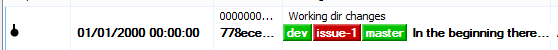
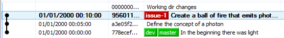
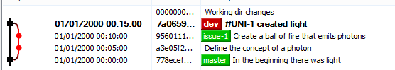
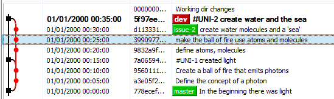
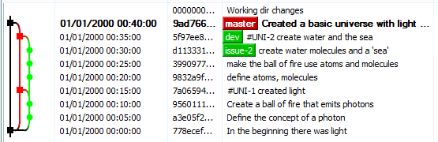
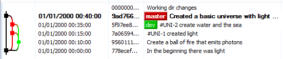

#Approaches to source control

##The simple feature branch

A developer starts working on a project. Full of excitement they create a local git repo:

Now they start working on the first feature, so they create a `dev` [branch][] (`> git branch dev`), and then [checkout][] (`> git checkout dev`) that branch:

> **Convention: all branch names should be lower case with words separated by `-`**. 
> 
> Case sensitivity in git servers can waste time, so just avoid the issue by using lower case.

Having the superpower of foresight, they realise it is likely that a customer will call and ask them to prioritise feature 2 while they are half way through feature 1. Therefore they decide to make a *feature branch* named with the issue number for the work. This time they type less by doing `> git checkout -b issue-1`:

Now they start work. The IDE provides an undo command but they know git provides a point-in-time fallback when they reach a natural checkpoint, or just before trying something risky. As such they [commit][] (`> git commit -a -m "a meaningful commit message"`) little and often to their local repository. 

And finally, happy that the work for the ticket is complete, they [merge][] it to the `dev` branch:

    > git checkout dev
    > git merge --no-ff -m "#UNI-1 created light" issue-1

Being keen to crack on, they immediately start work on issue 2 by going back to the *feature branch* and renaming it:

    > git checkout issue-1
    > git branch -m issue-2

After a few more pieces of work, it looks like this:

> **Convention: reuse and rename feature branches as this keeps the git graph cleaner**

That was some day, but all of the tests pass, it looks good and it is time to show people what had been done. It all gets merged into `master` and released to the general public...
    
    > git checkout master
    > git merge --no-ff -m "Created a basic universe with light and water" dev

###The feature branch

This episode illustrated the *feature branch*: a separate branch used to do all the minor commits used to develop a feature. The *feature branch*:

 - is itself a branch from the `dev` branch, usually named after the issue currently being worked on;
 - usually has commits that are a building and test-passing project, but this is not necessarily true - a commit may be part of a tricky refactoring (so might not build);
 - is therefore usually not pushed to the remote on every commit;
 - can even contain smaller *unit branches* - it is up to the developer to use branches to help them work faster. 
 - is merged to the `dev` branch once a feature is complete. 

Multiple *feature branches* may be required before a project is ready to be released into live. Reusing the last branch by renaming it keeps the git graph cleaner.

The `dev` branch:

 - is merged into `master` once a feature set is ready, and the automatic deployment (hopefully!) to the live environment can occur from `master`.
 - aggregates and summarises feature development with one `dev` commit per completed feture. 

The feature commits are still available for scrutiny at a later date in the merged feature branches, but the `dev` branch is a quick way to see what was done at a broad-strokes level, for example:

#Team conventions

 1. Branch names should be lower case with words separated by `-`.
 1. Reuse (and rename) feature branches as this keeps the git graph cleaner.
 1. `dev` is used to aggregate feature work: all testing, merging, fixing is done in `dev`.
 1. `master` is for versions that are safe to release to live once they are fully tested in `dev`.

 [next page >>](01-02-multiple-feature-branches.md)

 [branch]: http://git-scm.com/docs/git-branch "git branch"
 [checkout]: http://git-scm.com/docs/git-checkout "git checkout"
 [commit]: http://git-scm.com/docs/git-commit "git commit"
 [merge]: http://git-scm.com/docs/git-merge "git merge"
