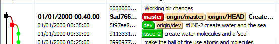
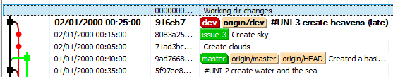
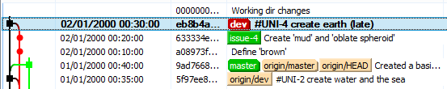
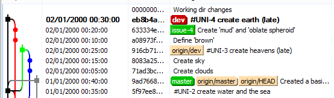
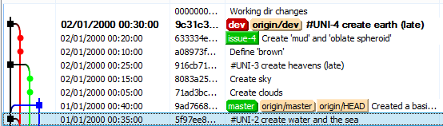
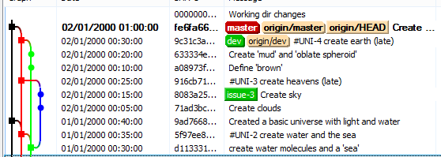

#Approaches to source control

##Multiple developers

Day 2 in the big developer house ...

... and it is obvious this work is going to take a long time. In comes another developer. Now we can do two features *in parallel*. Everyone knows parallel is better, so the team creates a remote repo and tracks the `master` and `dev` branches.

####Developer 1 cracks on

Now they start work on their assigned tickets within their own copies

    dev1> git checkout issue-2
    dev1> git branch -m issue-3
    (... do some work and some commits)

Finally developer 1 merges to `dev` and does a [push][] to the remote `dev` branch so bearded dev can see the changes:

    dev1> git checkout dev
    dev1> git merge --no-ff -m "#UNI-3 create heavens (late)" issue-3
    dev1> git push origin dev

####Meanwhile, in the beardy cupboard

Meanwhile the new bearded employee, shut off in his little cupboard, does:

    dev2> git checkout -b issue-4 d113331
    (... do some work and some commits)
    dev2> git checkout dev
    dev2> git merge --no-ff -m "#UNI-4 create earth (late)" issue-4

And now wants to send it to his new team, eager to make a good impression:

    dev2> git push origin dev
     ! [rejected]        dev -> dev (fetch first)
    error: failed to push some refs to 'H:\VaultAB\TIB\Solutions\FFL\Orchard dev\gitflow-master'
    hint: Updates were rejected because the remote contains work that you do
    hint: not have locally. This is usually caused by another repository pushing
    ...

What??? Ok, he strokes his beard and reads the errors. Ah! so developer 1 got there first. Fair enough, so we [fetch][] the remote:

    dev2> git fetch origin dev

That doesn't look too bad. Let's do this (tip: first back up your local repo using zip):

    dev2> git reset --h origin/dev
    dev2> git merge --no-ff -m "#UNI-4 create earth (late)" issue-4
    Auto-merging afile.txt
    CONFLICT (content): Merge conflict in afile.txt
    Automatic merge failed; fix conflicts and then commit the result.

Oh boy. The beard edited the same file as developer 1. No choice but to merge them. After doing some pair programming with developer 1 to make sense of the merge, beardy runs the push again once he is happy with it:

And finally dev 1 checks it all works in it's current form, and merges to master:

    dev1> git pull --no-rebase origin dev
    dev1> git checkout master
    dev1> git merge --no-ff -m "Create heaven and earth (late)" dev
    dev1> git push origin master

The whole system worked well. It is plainly obvious from the git graph what has been done, which commits correspond to which ticket, and where the "golden" commits are that can be released to live.

In reality repos are never this tidy, and feature branches are actually a poor-man's way of using DVCS. But for small teams with good communication they work.

#Tips

 - Commit early, commit often: commit all your thoughts and workings on a very frequent basis to your personal feature/feature-unit branch.
 - Squash is your friend: when you are ready to reduce noise in your branch, do so.
 - pull `dev` before you merge to `dev` and push, this reduces the chance of headaches

Further reading: 

 - [Feature Branches - Martin Fowler](http://martinfowler.com/bliki/FeatureBranch.html)
 - [Commit Often, Perfect Later, Publish Once](https://sethrobertson.github.io/GitBestPractices/)

.

 [<< previous page](01-01-feature-branches.md)

 [push]: http://git-scm.com/docs/git-push "git push"
 [fetch]: http://git-scm.com/docs/git-fetch "git fetch"